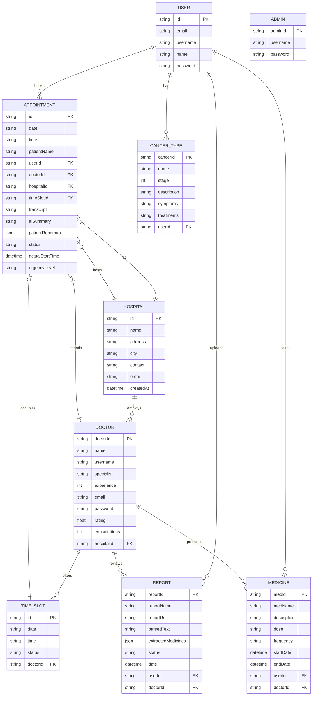

```mermaid
erDiagram
    USER ||--o{ APPOINTMENT : "books"
    USER ||--o{ REPORT : "uploads"
    USER ||--o{ MEDICINE : "takes"
    USER ||--o{ CANCER_TYPE : "has"

    HOSPITAL ||--o{ DOCTOR : "employs"
    HOSPITAL ||--o{ APPOINTMENT : "hosts"

    DOCTOR ||--o{ APPOINTMENT : "attends"
    DOCTOR ||--o{ TIME_SLOT : "offers"
    DOCTOR ||--o{ REPORT : "reviews"
    DOCTOR ||--o{ MEDICINE : "prescribes"

    APPOINTMENT |o--|| TIME_SLOT : "occupies"
    APPOINTMENT }|--|| HOSPITAL : "at"

    USER {
        string id PK
        string email
        string username
        string name
        string password
    }

    HOSPITAL {
        string id PK
        string name
        string address
        string city
        string contact
        string email
        datetime createdAt
    }

    DOCTOR {
        string doctorId PK
        string name
        string username
        string specialist
        int experience
        string email
        string password
        float rating
        int consultations
        string hospitalId FK
    }

    APPOINTMENT {
        string id PK
        string date
        string time
        string patientName
        string userId FK
        string doctorId FK
        string hospitalId FK
        string timeSlotId FK
        string transcript
        string aiSummary
        json patientRoadmap
        string status
        datetime actualStartTime
        string urgencyLevel
    }

    TIME_SLOT {
        string id PK
        string date
        string time
        string status
        string doctorId FK
    }

    ADMIN {
        string adminId PK
        string username
        string password
    }

    MEDICINE {
        string medId PK
        string medName
        string description
        string dose
        string frequency
        datetime startDate
        datetime endDate
        string userId FK
        string doctorId FK
    }

    REPORT {
        string reportId PK
        string reportName
        string reportUrl
        string parsedText
        json extractedMedicines
        string status
        datetime date
        string userId FK
        string doctorId FK
    }

    CANCER_TYPE {
        string cancerId PK
        string name
        int stage
        string description
        string symptoms
        string treatments
        string userId FK
    }
```
