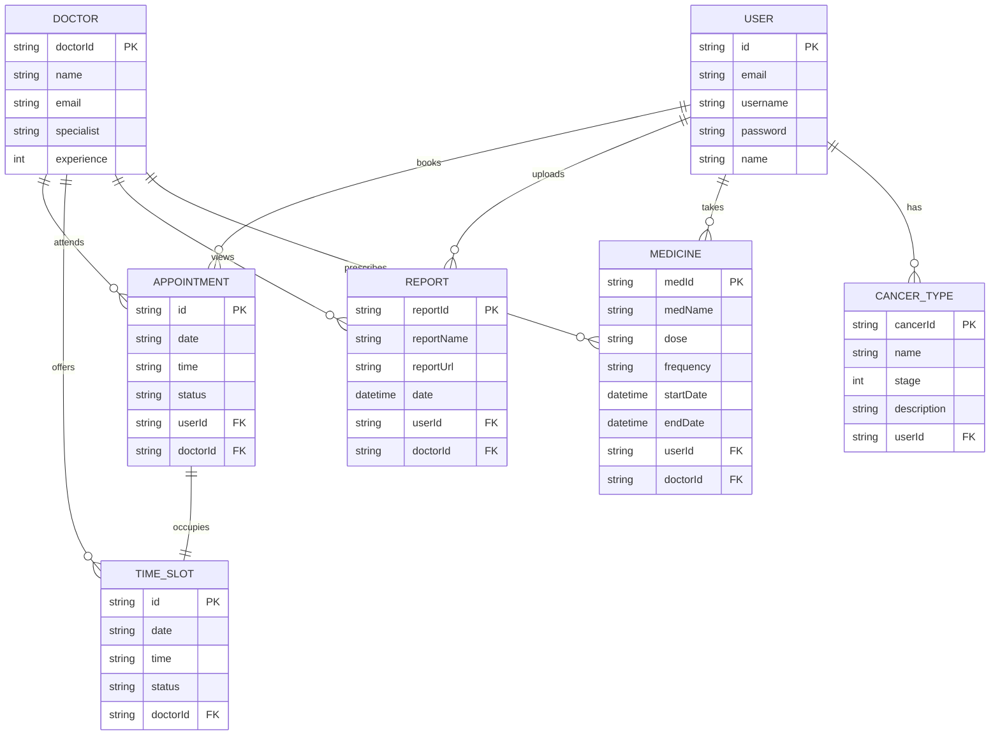

```mermaid
erDiagram
    USER ||--o{ APPOINTMENT : books
    USER ||--o{ REPORT : uploads
    USER ||--o{ MEDICINE : takes
    USER ||--o{ CANCER_TYPE : has

    DOCTOR ||--o{ APPOINTMENT : attends
    DOCTOR ||--o{ TIME_SLOT : offers
    DOCTOR ||--o{ REPORT : views
    DOCTOR ||--o{ MEDICINE : prescribes

    APPOINTMENT ||--|| TIME_SLOT : occupies

    USER {
        string id PK
        string email
        string username
        string password
        string name
    }

    DOCTOR {
        string doctorId PK
        string name
        string email
        string specialist
        int experience
    }

    APPOINTMENT {
        string id PK
        string date
        string time
        string status
        string userId FK
        string doctorId FK
    }

    TIME_SLOT {
        string id PK
        string date
        string time
        string status
        string doctorId FK
    }

    MEDICINE {
        string medId PK
        string medName
        string dose
        string frequency
        datetime startDate
        datetime endDate
        string userId FK
        string doctorId FK
    }

    REPORT {
        string reportId PK
        string reportName
        string reportUrl
        datetime date
        string userId FK
        string doctorId FK
    }

    CANCER_TYPE {
        string cancerId PK
        string name
        int stage
        string description
        string userId FK
    }
```
