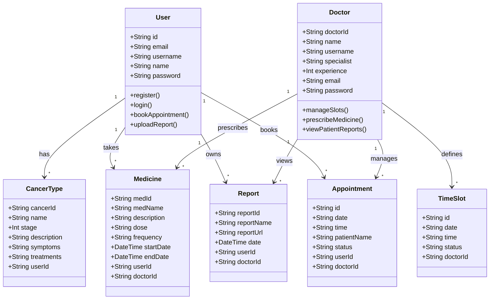

```mermaid
classDiagram
    class User {
        +String id
        +String email
        +String username
        +String name
        +String password
        +register()
        +login()
        +bookAppointment()
        +uploadReport()
    }

    class Doctor {
        +String doctorId
        +String name
        +String username
        +String specialist
        +Int experience
        +String email
        +String password
        +manageSlots()
        +prescribeMedicine()
        +viewPatientReports()
    }

    class Appointment {
        +String id
        +String date
        +String time
        +String patientName
        +String status
        +String userId
        +String doctorId
    }

    class TimeSlot {
        +String id
        +String date
        +String time
        +String status
        +String doctorId
    }

    class Medicine {
        +String medId
        +String medName
        +String description
        +String dose
        +String frequency
        +DateTime startDate
        +DateTime endDate
        +String userId
        +String doctorId
    }

    class Report {
        +String reportId
        +String reportName
        +String reportUrl
        +DateTime date
        +String userId
        +String doctorId
    }

    class CancerType {
        +String cancerId
        +String name
        +Int stage
        +String description
        +String symptoms
        +String treatments
        +String userId
    }

    User "1" --> "*" Appointment : books
    Doctor "1" --> "*" Appointment : manages
    Doctor "1" --> "*" TimeSlot : defines
    User "1" --> "*" Report : owns
    Doctor "1" --> "*" Report : views
    User "1" --> "*" Medicine : takes
    Doctor "1" --> "*" Medicine : prescribes
    User "1" --> "*" CancerType : has
```
