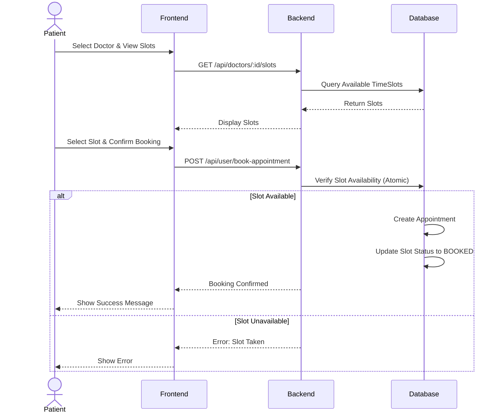

```mermaid
sequenceDiagram
    actor Patient
    participant Frontend
    participant Backend
    participant Database

    Patient->>Frontend: Select Doctor & View Slots
    Frontend->>Backend: GET /api/doctors/:id/slots
    Backend->>Database: Query Available TimeSlots
    Database-->>Backend: Return Slots
    Backend-->>Frontend: Display Slots

    Patient->>Frontend: Select Slot & Confirm Booking
    Frontend->>Backend: POST /api/user/book-appointment
    Backend->>Database: Verify Slot Availability (Atomic)
    alt Slot Available
        Database->>Database: Create Appointment
        Database->>Database: Update Slot Status to BOOKED
        Backend-->>Frontend: Booking Confirmed
        Frontend-->>Patient: Show Success Message
    else Slot Unavailable
        Backend-->>Frontend: Error: Slot Taken
        Frontend-->>Patient: Show Error
    end
```
